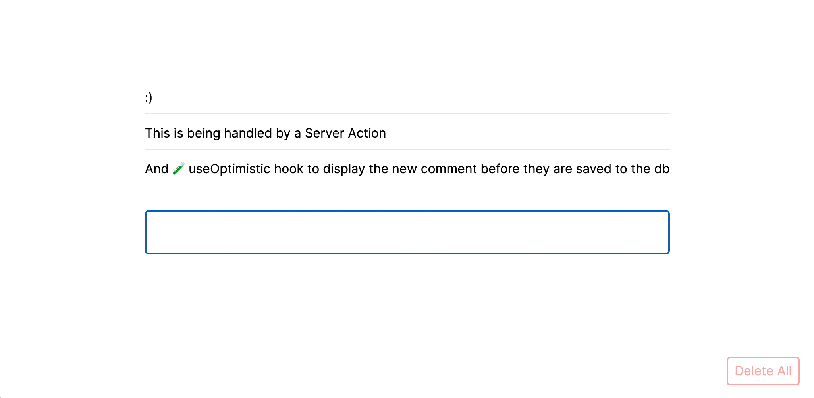

# NextJS Server Action Demo + Optimistic Hook



## Getting Started

First, run the following command for Prisma:

```bash
npm run migrate
```

Then run the development server:

```bash
npm run dev
# or
yarn dev
# or
pnpm dev
```

Open [http://localhost:3000](http://localhost:3000) with your browser to see the result.

Blog post: [Server Actions in Next.js: Enhancing
User Experience with Optimistic Updates](https://codexi.com/blog/server-actions-in-nextjs-enhancing-user-experience-with-optimistic-updates)
